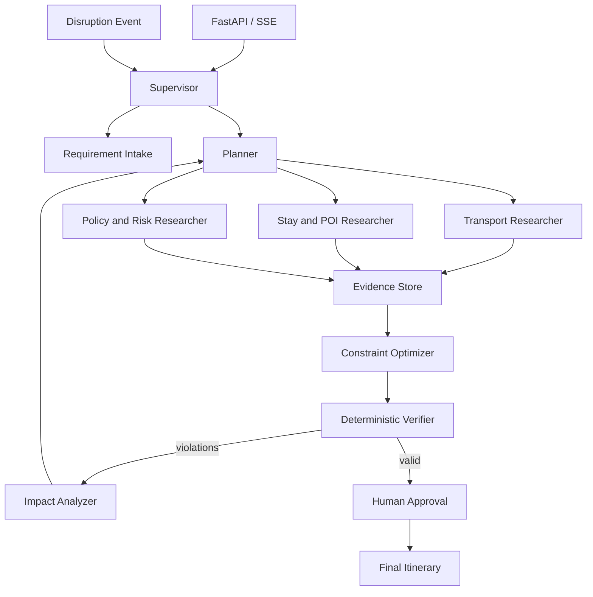

# TripOps 总体架构

## 控制流

## 四层上下文

| 层 | 生命周期 | 内容 | 写入者 |
|---|---|---|---|
| Runtime Context | 单次运行 | tenant、user、权限、模型、预算 | API/Auth |
| Graph State | 单个任务线程 | 需求、约束、DAG、证据引用、violations | Graph nodes |
| Long-term Store | 跨线程 | 用户偏好、历史选择、常用出发地 | Memory service |
| Artifact Store | 按保留策略 | 网页、工具原始响应、长报告 | Tools/Researchers |

## Agent 边界

- Supervisor 不直接搜索，也不直接生成完整行程，只决定控制流。
- Planner 不调用外部事实工具，只构造或修订任务 DAG。
- Researcher 只能输出 `Evidence`，不能修改计划或宣布任务完成。
- Verifier 只消费结构化行程、约束和证据，输出 `Violation`。
- 确定性校验优先；只有主观偏好和证据充分性允许模型辅助判断。

## 工具调用生命周期

1. 节点根据 capability 请求候选工具。
2. Registry 按角色、权限、风险和熔断状态过滤。
3. Router 结合任务、成本和 freshness 选择最小工具集合。
4. Middleware 执行参数校验、审批、超时、重试、缓存和 fallback。
5. 大结果写入 Artifact Store，返回摘要和 artifact reference。
6. 统一事件总线记录工具结果、延迟、成本和降级原因。

## 关键设计决策

- 使用 LangGraph 自定义主图，而不是将控制流完全交给通用 ReAct 循环。
- 叶子 Agent 使用 LangChain `create_agent`，共享统一 Middleware 契约。
- 使用 Pydantic 模型作为节点边界，禁止用自由文本模拟状态机。
- 首版 checkpoint 采用 SQLite；接口保持可替换，生产化时可切 PostgreSQL。
- 首版保留 Milvus 兼容能力，关键词索引和融合层保持存储无关。

