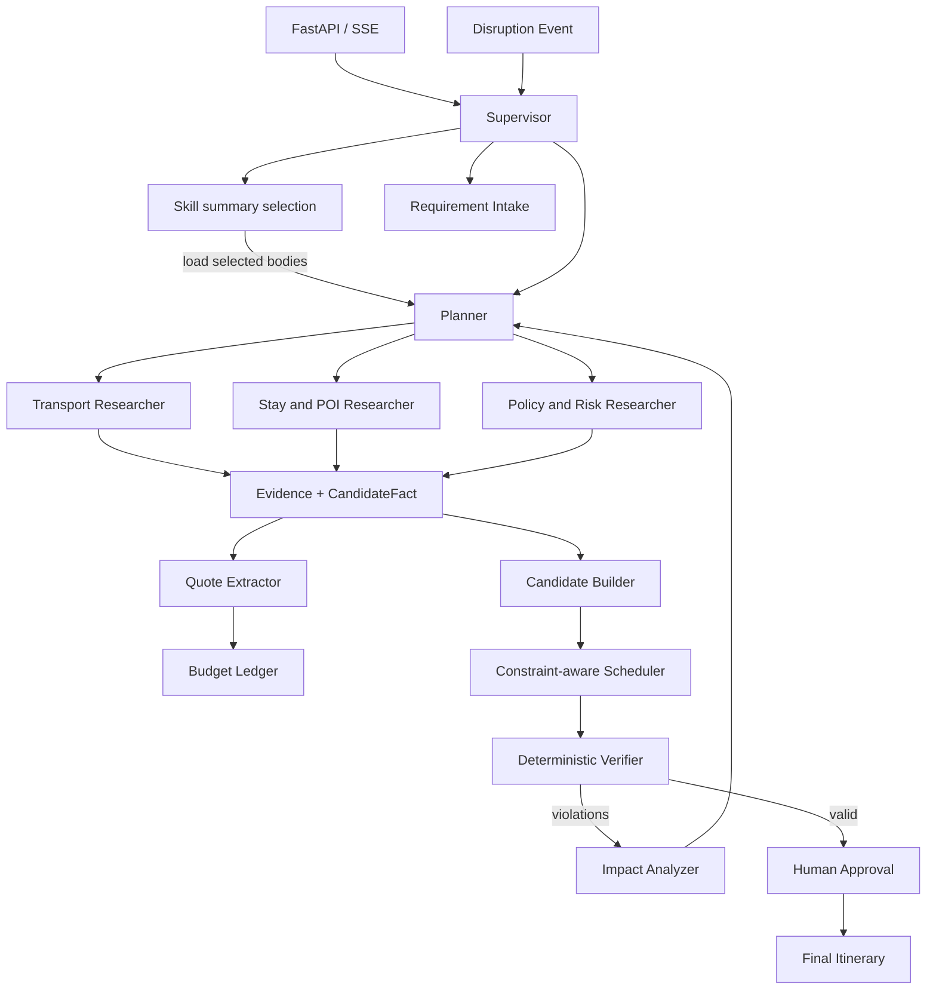

# TripOps 总体架构

## 控制流

## 四层上下文

| 层 | 生命周期 | 内容 | 写入者 |
|---|---|---|---|
| Runtime Context | 单次运行 | tenant、user、权限、模型、预算 | API/Auth |
| Graph State | 单个任务线程 | 需求、约束、DAG、证据引用、violations | Graph nodes |
| Long-term Store | 跨线程 | 用户偏好、历史选择、常用出发地 | Memory service |
| Artifact Store | 按保留策略 | 网页、工具原始响应、长报告 | Tools/Researchers |

`ContextCompiler` 在模型调用前把四层数据编译成有界 envelope：Violation 和结构化 Request 优先；Evidence 按 confidence、freshness 和数量过滤；大结果只携带 `artifact://` 引用；每个被截断的 section 都进入审计字段。

## Agent 边界

- Supervisor 不直接搜索，也不直接生成完整行程，只决定控制流。
- Planner 不调用外部事实工具，只构造或修订任务 DAG，不在 Research 之前生成 itinerary。
- Researcher 只能输出 `Evidence` 和引用该 Evidence 的 `CandidateFact`，不能直接修改计划或宣布任务完成。
- Candidate Builder 去重、规范化真实候选，并为缺失的“目的地 × 时段”显式补入 demo candidate；网页搜索结果本身不是可排程实体。
- Quote Extractor 从网页证据抽取报价区间、币种、计价单位与预订链接，校验旅行年份和目的地；Budget Ledger 使用带日期的参考汇率，并按房间晚数、旅行人数和餐次生成区间预算。
- Route allocator 按目的地顺序生成连续城市日期段，并在边界日生成带交通 Evidence 的固定转场 slot。
- 确定性 Scheduler 在研究后负责按当日城市过滤候选、时间槽、预算和 Jain fairness。未知价格不会以零元充当真实报价。
- Verifier 只消费结构化行程、约束和证据，输出 `Violation`。
- 确定性校验优先；只有主观偏好和证据充分性允许模型辅助判断。

## 工具调用生命周期

1. 节点根据 capability 请求候选工具。
2. Registry 按角色、权限、风险和熔断状态过滤。
3. Router 结合任务、成本和 freshness 选择最小工具集合。
4. Middleware 执行参数校验、审批、超时、重试、缓存和 fallback。
5. 大结果写入 Artifact Store，返回摘要和 artifact reference。
6. 统一事件总线记录工具结果、延迟、成本和降级原因。

## 关键设计决策

- 使用 LangGraph 自定义主图，而不是将控制流完全交给通用 ReAct 循环。
- `offline` 模式使用规则 Agent 保证无密钥复现；`llm` 模式使用 LangChain structured output，边界仍为 Pydantic。
- LangChain Middleware 契约覆盖 Skills 注入、动态工具最小暴露、模型预算和受治理工具执行，可供叶子 `create_agent` 复用。
- 使用 Pydantic 模型作为节点边界，禁止用自由文本模拟状态机。
- 首版 checkpoint 采用 SQLite；接口保持可替换，生产化时可切 PostgreSQL。
- 首版保留 Milvus 兼容能力，关键词索引和融合层保持存储无关。

## 规划与局部修订

候选目录先根据排除活动、安全属性做硬过滤，再按 required activity、每位旅客的边际偏好覆盖、对当前最少满足成员的公平增益和成本排序。每个 item 保存候选、slot、匹配偏好和选择分数。发生 disruption 后，Impact Analyzer 沿时间和任务 DAG 传播影响；Scheduler 按 `slot_key` 原样保留 `preserved_item_ids`，只为受影响 slot 生成新 revision。API 集成测试验证 15 项行程中只替换 3 项并保留 12 项。

## RAG 数据生命周期

`DocumentChunker` 负责规范化、稳定 ID、重叠分块、内容去重及 volatility freshness；`HybridCorpus` 原子替换版本化快照。查询并行执行 BM25 与 Dense，RRF 融合后通过 lexical fallback 或 CrossEncoder 重排，最终 Citation 保留 URI、抓取时间、有效期和 chunk ID。
